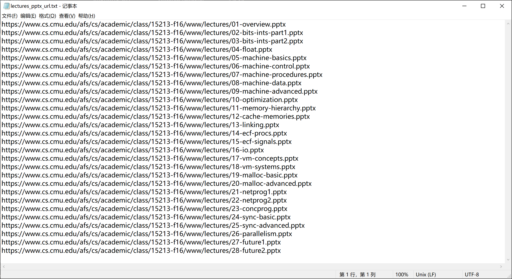

# 批量下载页面的链接

使用工具：wget

wget的Windows版本的下载、配置环境变量：
[wget 递归下载大部分网站目录](https://blog.csdn.net/weixin_46403483/article/details/107696272)
[wget 在windows系统的配置和使用](https://www.bilibili.com/video/BV1Dq4y1Y7xP/)


## 示例1

相关资料：
[批量提取网页中的超链接](https://blog.csdn.net/weixin_46605479/article/details/125590235)
[解决 Chrome 120 开发人员工具 无法粘贴代码](https://blog.csdn.net/weixin_44816664/article/details/135213622)
[批量提取包含指定字符串的行](https://blog.csdn.net/zyjtx321/article/details/104037542)

页面：[15-213/18-213/15-513: Intro to Computer Systems, Fall 2016](https://www.cs.cmu.edu/afs/cs/academic/class/15213-f16/www/schedule.html)


进入页面的“开发者工具”的“Console”

如果提示：

```
Warning: Don’t paste code into the DevTools Console that you don’t understand or haven’t reviewed yourself. This could allow attackers to steal your identity or take control of your computer. Please type ‘allow pasting’ below to allow pasting.
```

则输入：

```
allow pasting
```

输入：

```javascript
for (var a of document.getElementsByTagName('a') ) {
    console.log(a.href)
}
```

提取出页面的链接：


简单处理后，保存在original.txt中：


打开Git Bash，输入：

```bash
grep '.pptx' original.txt > pptx_url.txt
sort pptx_url.txt -o pptx_url.txt
grep '/lectures/' pptx_url.txt > lectures_pptx_url.txt
```

提取出要下载的ppt的链接：



输入：

```bash
grep '.pdf' original.txt > pdf_url.txt
sort pdf_url.txt -o pdf_url.txt
grep '/lectures/'  pdf_url.txt > lectures_pdf_url.txt
```

提取出要下载的pdf的链接：


打开CMD，输入：

```
wget -i lectures_pptx_url.txt
```

wget下载要下载的ppt：


输入：

```
wget -i lectures_pdf_url.txt
```

wget下载要下载的pdf，下载完成：


## 示例2

页面：[Index of /afs/cs/academic/class/15213-f16/www/code](https://www.cs.cmu.edu/afs/cs/academic/class/15213-f16/www/code/)


打开CMD，输入：

```
wget -r -np -nH https://www.cs.cmu.edu/afs/cs/academic/class/15213-f16/www/code/
```


wget还有很多功能，如克隆整个网站等。
